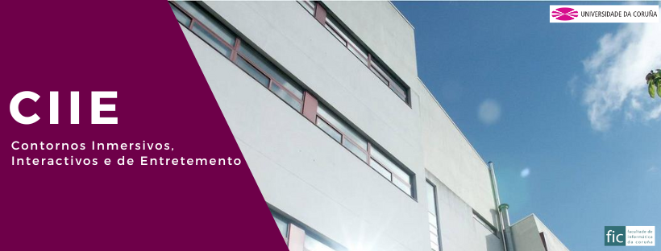

# GEI_CIIE
 



Repositorio con los ejemplos de PyGame utilizados en la asignatura "Contornos Inmersivos Interactivos y de Entretenimiento" de la Universidade da Coruña.

## Requisitos Previos

- Python 3.8 o superior
- pip (gestor de paquetes de Python)
- (Opcional) uv (gestor de paquetes alternativo más rápido)

## Dependencias

El proyecto requiere las siguientes dependencias:

- pygame==2.5.2 (biblioteca para el desarrollo de juegos)

## Configuración del Entorno Virtual

### Método 1: Usando pip (método tradicional)

1. Crear un entorno virtual:
```bash
python -m venv venv
```

2. Activar el entorno virtual:
- En Windows:
```bash
venv\Scripts\activate
```
- En Linux/Mac:
```bash
source venv/bin/activate
```

3. Instalar las dependencias:
```bash
pip install -r requirements.txt
```

### Método 2: Usando uv (método recomendado)

1. Instalar uv (si no lo tienes):
```bash
pip install uv
```

2. Crear y activar el entorno virtual:
```bash
uv venv
```

3. Activar el entorno virtual:
- En Windows:
```bash
.\venv\Scripts\activate
```
- En Linux/Mac:
```bash
source venv/bin/activate
```

4. Instalar las dependencias:
```bash
uv pip install -r requirements.txt
```

## Estructura del Repositorio

Este repositorio contiene ejemplos prácticos de PyGame que se utilizan durante el curso para ilustrar diferentes conceptos de programación de juegos y aplicaciones interactivas.

### Ejemplos Disponibles

#### 1. Pong
Una implementación progresiva del clásico juego Pong, que muestra diferentes conceptos de programación de juegos:

1. `1 - solo se crea la pantalla y sale.py`: Ejemplo básico de inicialización de PyGame
2. `2 - con el bucle infinito.py`: Implementación del bucle principal del juego
3. `3 - la pelota se mueve (muy rapido).py`: Añade movimiento básico a la pelota
4. `4 - con reloj.py`: Control de FPS y velocidad del juego
5. `5 - la pelota rebota en los limites.py`: Implementación de colisiones con los bordes
6. `6 - con las raquetas.py`: Añade las raquetas al juego
7. `7 - las raquetas se mueven.py`: Control de movimiento de las raquetas
8. `8 - teclas pulsadas y sin raton.py`: Mejora del control de teclado
9. `9 - las raquetas no se salen.py`: Límites de movimiento de las raquetas
10. `10 - colisiones con las raquetas.py`: Sistema de colisiones con las raquetas
11. `11 - pausa y reinicio cuando el jugador falla.py`: Sistema de pausa y reinicio
12. `12 - contando los puntos.py`: Sistema de puntuación básico
13. `13 - marcadores.py`: Visualización de la puntuación
14. `14 - mensaje inicial y espera.py`: Pantalla de inicio y espera
15. `15 - con sonidos.py`: Añade efectos de sonido
16. `16 - con imagen de fondo.py`: Implementación de fondos gráficos
17. `17 - orientacion a objetos.py`: Refactorización usando programación orientada a objetos
18. `18 - con sprites.py`: Implementación usando el sistema de sprites de PyGame

#### 2. Sprites
Una serie de ejemplos que muestran el uso de sprites y animaciones en PyGame:

1. `1 - toda la imagen como Sprite.py`: Ejemplo básico de creación de un sprite
2. `2 - sprite animado.py`: Implementación de animación básica de sprites
3. `3 - sprite se mueve mas despacio.py`: Control de velocidad del sprite
4. `4 - mirando hacia los dos lados.py`: Control de dirección y orientación del sprite
5. `5 - con grupos.py`: Uso de grupos de sprites para gestión eficiente
6. `6 - con postura de estar quieto y movimiento medido.py`: Estados y transiciones de animación
7. `7 - con saltos.py`: Implementación de mecánicas de salto
8. `8 - con gestor de recursos.py`: Sistema de gestión de recursos para sprites y animaciones

#### 3. Plataformas
Ejemplos de juegos de plataformas que muestran diferentes aspectos de la programación de juegos:

##### 3.1 Plataformas (Un jugador)
Un juego de plataformas básico que muestra la implementación de:
- Sistema de física básica (gravedad, saltos)
- Colisiones con plataformas
- Animaciones de personaje
- Gestión de recursos
- Estructura modular del código

Archivos principales:
- `main.py`: Punto de entrada del juego
- `configuracion.py`: Configuraciones globales
- `recursos.py`: Gestión de recursos (imágenes, sonidos)
- `personajes.py`: Lógica de los personajes
- `fase.py`: Gestión del nivel y plataformas

##### 3.2 Plataformas (Dos jugadores)
Versión extendida del juego de plataformas que añade:
- Control de dos jugadores simultáneos
- Interacción entre jugadores
- Sistema de colisiones mejorado
- Gestión de recursos compartidos

Archivos principales:
- `main.py`: Punto de entrada del juego
- `configuracion.py`: Configuraciones globales
- `recursos.py`: Gestión de recursos (imágenes, sonidos)
- `personajes.py`: Lógica de los personajes
- `fase.py`: Gestión del nivel y plataformas

##### 3.3 Patron director
Versión extendida del juego de plataformas que añade:
- Un controlador de escena basado en colas
- Modularización de la gestión de los eventos y la pantalla
- Un sistema de transición de escenas
- La definición de las escenas

Archivos principales:
- `main.py`: Punto de entrada del juego
- `configuracion.py`: Configuraciones globales
- `recursos.py`: Gestión de recursos (imágenes, sonidos)
- `personajes.py`: Lógica de los personajes
- `fase.py`: Gestión del nivel y plataformas
- `escena.py`: Interface declarativo para cualquier escena
- `director.py`: Clase que implementa el patrón director

##### 3.4 Manú inicial
Versión extendida del juego de plataformas que añade:
- Añadir todos los elementos para la creación de GUI
- Patrón Plantilla en los elementos que heredan de ElementoGUI
- Patrón Strategy para cada uno de los elementos la acción a desarrollar
- Patrón Fachada en los menús donde delegan todos los elementosGUI
- Patrón Composite ya que todos los elementosGUI saben el Panel al que pertenecen y quien delega las funciones

Archivos principales:
- `main.py`: Punto de entrada del juego
- `configuracion.py`: Configuraciones globales
- `recursos.py`: Gestión de recursos (imágenes, sonidos)
- `personajes.py`: Lógica de los personajes
- `fase.py`: Gestión del nivel y plataformas
- `escena.py`: Interface declarativo para cualquier escena
- `director.py`: Implementación del patrón director
- `menu.py`: Todos los elementos relativos a la creación de menús


## Uso

Una vez configurado el entorno virtual y instaladas las dependencias, puedes ejecutar los ejemplos individuales siguiendo las instrucciones específicas de cada uno.

## Notas Adicionales

- Se recomienda mantener el entorno virtual actualizado con las últimas versiones de las dependencias.
- Si encuentras algún problema o tienes sugerencias, no dudes en abrir un issue en el repositorio.
